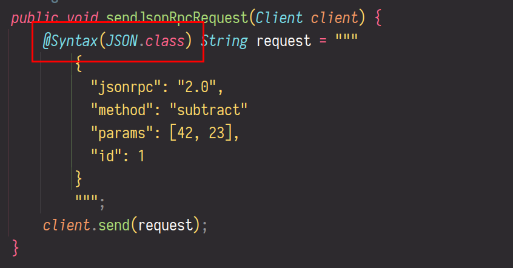
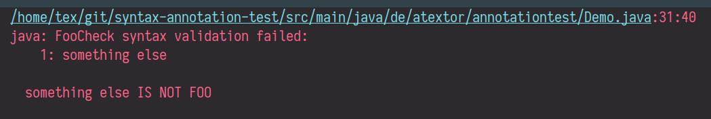

# syntax-annotation

[](https://github.com/atextor/syntax-annotation/actions/workflows/build.yml)  [](https://www.apache.org/licenses/LICENSE-2.0)

_Make your Java code a little more type safe by adding compile time syntax
checks for strings containing other languages!_

Add the `@Syntax` annotation to your string literals and have your compilation/build fail if there
are syntax errors inside the string. This works on local variables and on fields, including static
fields. It works on regular strings (including strings that are split into parts and concatenated
using the + operator) as well as text blocks.

If you have some language embedded in a string, this would normally only fail at runtime:


Add `@Syntax` to the string:


Have the problem reported during compilation directly in your IDE - no IDE plugin required:


`@Syntax` not only works in the IDE, but also in your regular build:


## Usage

**syntax-annotation** requires Java 25.

Add the following dependency to your Maven `pom.xml`:
```xml
<dependency>
  <groupId>de.atextor</groupId>
  <artifactId>syntax-annotation</artifactId>
  <version>1.1.0</version>
  <scope>compile</scope>
</dependency>
```

Note the `compile` scope - since only an additional compile-time check is done, no runtime
dependencies are added to your project.

Since the annotation processor accesses the Java compiler, its module needs access to the
corresponding module. Add the following configuration to your `pom.xml`:

```xml
<build>
    <plugins>
        <plugin>
            <groupId>org.apache.maven.plugins</groupId>
            <artifactId>maven-compiler-plugin</artifactId>
            <version>3.8.1</version>
            <configuration>
                <showWarnings>true</showWarnings>
            </configuration>
            <executions>
                <execution>
                    <id>default-compile</id>
                    <phase>compile</phase>
                    <goals>
                        <goal>compile</goal>
                    </goals>
                    <configuration>
                        <fork>true</fork>
                        <compilerArgs>
                            <arg>-J--add-exports=jdk.compiler/com.sun.tools.javac.tree=ALL-UNNAMED</arg>
                        </compilerArgs>
                    </configuration>
                </execution>
            </executions>
        </plugin>
    </plugins>
</build>
```

## Supported languages

Currently, **syntax-annotation** provides check functions for the following languages:

* *JSON*: Use `de.atextor.syntax.JSON.class` as argument for `@Syntax`. In order to use this, make sure you have
  `com.fasterxml.jackson.core:jackson-core:2.21.0` and
  `com.fasterxml.jackson.core:jackson-databind:2.21.0` in your compile build path, i.e., add the
  corresponding dependency with scope compile if necessary.
* *Regular Expressions (as recognized by [java.util.regex.Pattern#compile](https://docs.oracle.com/en/java/javase/17/docs/api/java.base/java/util/regex/Pattern.html#compile(java.lang.String)))*: Use `de.atextor.syntax.RegExp.class` as argument for `@Syntax`. No additional
  dependencies are required.
* *XML*: Use `de.atextor.syntax.XML.class` as argument for `@Syntax`. No additional
  dependencies are required.
* *[RDF/Turtle](https://www.w3.org/TR/turtle/)*: Use `de.atextor.syntax.Turtle.class` as argument for `@Syntax`. In order to use this, make
  sure you have `org.apache.jena:jena-arq:5.6.0` in your compile build path, i.e., add the
  corresponding dependency with scope compile if necessary.

## Custom languages

Support for additional languages can easily be added. Write a class that implements
`java.util.Function<String, Optional<String>>`: The function that takes the string to syntax check
as input and returns `Optional.empty()` if the syntax is valid, or `Optional.of("error message")` if
the syntax is invalid. The class needs to have a default constructor and needs to be available on
the compile time class path. Then you can pass it as argument to the `@Syntax` annotation.

For example:
```java
/**
 * Syntax check: the annotated string must be equal to "foo"
 */
public class FooCheck implements Function<String, Optional<String>> {
    @Override
    public Optional<String> apply(String s) {
        return s.equals("foo") ? Optional.empty() : Optional.of(s + " IS NOT FOO");
    }
}
```

Then, to use it:
```java
public void fooDemo() {
    @Syntax(FooCheck.class) String thisMustBeFoo = "something else";
}
```

This will lead to a compilation failure:


Note that class path setup might be tricky if the syntax check function is part of the same code
base that wants to use it at compile time. To reliably set this up, put the check function into its
own maven module and add this module as dependency with compile scope to the code that uses the
function as `@Syntax` argument.

If your check function implementation uses a third party dependency, this dependency must be present
(at least in compile scope) in the code that uses `@Syntax`. For example, the `JSON` check function
that is part of syntax-annotation, uses Jackson to do its parsing, which is why you need to have
Jackson in your dependencies to use this check function.

## Release notes

* 1.1.0 Update to Java 25
* 1.0.0 First release

## Contact

**syntax-annotation** is developed by Andreas Textor <<mail@atextor.de>>.
